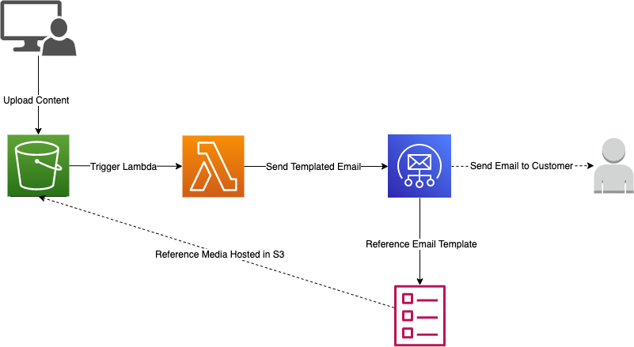

# Email Service with AWS Lambda and SES

This project demonstrates how to set up an Email Service using AWS Lambda and SES (Simple Email Service). The Lambda function triggers on S3 events, specifically when new CSV files are uploaded. It parses the CSV data and sends formatted email notifications to recipients.

## Project Overview

The Email Service integrates the following components:

- **AWS Lambda Function**: Processes S3 events triggered by new file uploads. It reads CSV data, formats it into an HTML table, and sends an email using SES.
  
- **AWS SES (Simple Email Service)**: Used for sending formatted email notifications to recipients.




## Prerequisites

Before getting started, ensure you have the following:

- Node.js (version >= 10.3.0)
- AWS CLI configured with appropriate credentials
- AWS CDK Toolkit (`npm install -g aws-cdk`)
- Basic knowledge of AWS Lambda, SES, and AWS CDK
- Existing S3 bucket (e.g `data-for-email-service` by default)
- SES-verified sender/recipient email addresses (see https://docs.aws.amazon.com/ses/latest/dg/creating-identities.html)

## Project Setup

1. **Clone the repository:**

2. **Install dependencies:**
npm install


3. **Configure Environment Variables:**
- Open `lambda/send_email.py` and set the following environment variables:
  - `SENDER_EMAIL_ADDRESS`: Email address from which emails will be sent.
  - `RECIPIENT_EMAIL_ADDRESS`: Email address of the recipient(s) for notifications.
  Notice these email addresses must be verified in SES (e.g in the AWS console)

4. **Build and Deploy the CDK Stack:**
- Deploy the AWS CDK stack to create the necessary infrastructure:
  ```
  cdk deploy
  ```
- This command deploys the Lambda function, configures the S3 event notification, and sets up SES for sending emails.

## Example Usage

1. **Upload CSV files to S3:**
- Upload CSV files to the S3 bucket (e.g `data-for-email-service` by default) configured in the AWS CDK stack.
- Ensure the CSV file name matches the expected pattern (e.g `athena-output/{query-id}.csv`).

2. **Email Notification:**
- The Lambda function triggers when a new CSV file is uploaded.
- It formats the CSV data into an HTML table and sends an email notification to the specified recipient(s) (`RECIPIENT_EMAIL_ADDRESS`).

## Customization

- **Email Template**: Customize the email template (`email_template.html`) located in the Lambda function code (`lambda/send_email.py`).
- Modify the HTML structure to change the appearance of the email body.

- **Lambda Function Logic**: Adjust the logic in `lambda/send_email.py` to handle specific CSV formats or additional processing requirements.

## Troubleshooting

If you encounter issues or errors during deployment or usage, consider the following steps:

- Check AWS CloudWatch Logs for the Lambda function (`send_email`) to diagnose any execution errors.
- Verify IAM permissions for the Lambda function and SES to ensure they have the necessary permissions (`ses:SendEmail`, `s3:GetObject`, etc.).
- Review AWS CDK deployment outputs for any configuration or resource creation errors.

## Additional Resources

- [AWS CDK Documentation](https://docs.aws.amazon.com/cdk/latest/guide/home.html)
- [AWS Lambda Documentation](https://docs.aws.amazon.com/lambda/latest/dg/welcome.html)
- [AWS SES Documentation](https://docs.aws.amazon.com/ses/latest/DeveloperGuide/Welcome.html)
